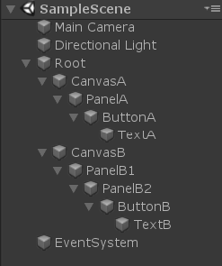
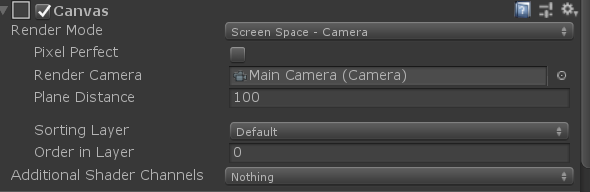

# GraphicRaycasterSample

## 概要

Unity2019以降ではuGUIがパッケージマネージャー経由になりましたが、そのタイミングで[EventSystem.RaycastAll](https://docs.unity3d.com/ja/2018.4/ScriptReference/EventSystems.EventSystem.html)によって得られるraycastResultsの内容がUnity2018.4迄と変更になりました。
結果として、Unity2018からUnity2019へ移行したらuGUIのボタンが反応しなくなるというケースが考えられます。

## 検証内容

検証対象となるSceneはこちらになります。



Canvasが２個存在しますが、どちらも設定内容は下記になります。



このSceneにおいて、EventSystem.RaycastAll()をUnity2018.4とUnity2019.4でそれぞれ実行し結果を比較します。

```C#
if (Input.GetMouseButtonDown(0))
        {
            mRaycastResults.Clear();
            mPointerEventData.position = Input.mousePosition;
            mEventSystem.RaycastAll(mPointerEventData, mRaycastResults);
            foreach(var raycastResult in mRaycastResults)
            {
                Debug.Log(raycastResult);
            }
        }
```

## 検証結果

Unity2018.4.31での実行結果

```Log
Name: TextB (UnityEngine.GameObject)
Name: ButtonB (UnityEngine.GameObject)
Name: TextA (UnityEngine.GameObject)
Name: PanelB2 (UnityEngine.GameObject)
Name: ButtonA (UnityEngine.GameObject)
Name: PanelB1 (UnityEngine.GameObject)
Name: PanelA (UnityEngine.GameObject)
```

Unity2019.4.19での実行結果

```Log
Name: TextB (UnityEngine.GameObject)
Name: ButtonB (UnityEngine.GameObject)
Name: PanelB2 (UnityEngine.GameObject)
Name: PanelB1 (UnityEngine.GameObject)
Name: TextA (UnityEngine.GameObject)
Name: ButtonA (UnityEngine.GameObject)
Name: PanelA (UnityEngine.GameObject)
```

ソートされた結果が異なることが見てとれます。
但し、CanvasのRenderModeを[Screen Space - Overlay](https://docs.unity3d.com/ja/2018.4/ScriptReference/RenderMode.ScreenSpaceOverlay.html)にした場合は、Unity2018,Unity2019共に同じ結果となります。

## 考察

[RaycasterResult](https://docs.unity3d.com/ja/2018.4/ScriptReference/EventSystems.RaycastResult.html)の比較処理に変更が入った為、上記のような違いが発生しています。

具体的にはdepth(階層構造の深さ)の比較を行う際の条件が、Unity2019ではrootRaycaster()が同じである時に限定されています。

今回のSceneではCanvasA,CanvasBがそれぞれ分割して存在しており、それぞれのCanvasにぶら下がっているUIのパーツはお互いにdepthで比較されべきではありません。(つまりUnity2018のRaycastCompareには問題があった)

Packageに含まれているEventSystem.csを確認すると下記のように記載されています。

```C#
private static int RaycastComparer(RaycastResult lhs, RaycastResult rhs)
{
    ...
    // comparing depth only makes sense if the two raycast results have the same root canvas (case 912396)
    if (lhs.depth != rhs.depth && lhs.module.rootRaycaster == rhs.module.rootRaycaster)
                return rhs.depth.CompareTo(lhs.depth);
    ...
}
```

## まとめ

Unity2019になってからUIに反応しない部分がある場合、異なるCanvasにぶら下がっているUIのdepthの比較を期待している部分がないか確認しててみると問題が解決するかもしれません。